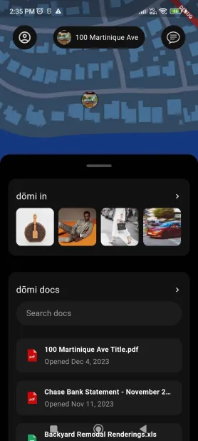

# Digital Domi

Digital Domi, a technology company that is developing a platform for managing mail and communication.

## Requirements

- [Dart](https://dart.dev/get-dart) and [Flutter](https://docs.flutter.dev/get-started/install) SDK
- [Android Studio](https://developer.android.com/studio/install) or [VS Code](https://code.visualstudio.com/download)
- [Google Maps](https://developers.google.com/maps) API Key

## Installation

1. Clone the repository or download the source code.

```bash
git clone https://github.com/tangobeee/traffic-processor.git
cd "traffic-processor"
```

2. Run the setup script to install Kafka and start the application.

```bash
./setup
```

3. Verify that Kafka is running and the application is logging traffic.

## Usage

1. Modify the `src/main.sh` script to customize logging behavior or Kafka configuration as needed.

2. Run the application using the provided start script.

```bash
./start.sh
```

3. Monitor the log file `(traffic.log)` for HTTP traffic logs.

4. Optionally, configure Kafka consumers to process the logged data from the Kafka topic.

## Configuration

1. Kafka broker details can be configured in `etc/kafka.cfg`.

2. Logging behavior and other application settings can be adjusted in `src/main.sh`.

## Screenshot

<div>
   
</div>


## License

This project is licensed under the MIT License.