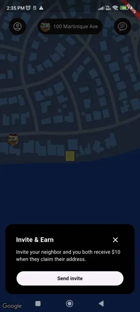

# Digital Domi

**Digital Domi** is a technology platform designed for managing mail and communication.

## Requirements

- [Dart](https://dart.dev/get-dart) and [Flutter](https://docs.flutter.dev/get-started/install) SDK
- [Android Studio](https://developer.android.com/studio/install) or [VS Code](https://code.visualstudio.com/download)
- [Google Maps](https://developers.google.com/maps) API Key

## Installation

1. Clone the repository or download the source code.

```bash
git clone https://github.com/tangoBeee/digital_domi
cd "digital_domi"
```

2. Install dependencies

```bash
flutter pub get
```

## Usage

1. Add your [Google Maps API key](https://console.cloud.google.com/project/_/google/maps-apis/credentials) to `android/app/src/main/AndroidManifest.xml` and `ios/Runner/AppDelegate.swift`.

2. Run the application using the provided command.

```bash
flutter run
```

## Configuration

1. To customize the map styling, add the `mapId` in `lib/widgets/map_view.dart` (line: 102)

## Demo
Watch the [video demo](https://youtu.be/78xYb0ezOLY).

## Screenshot

<div>
   
</div>


## License

This project is licensed under the MIT License.